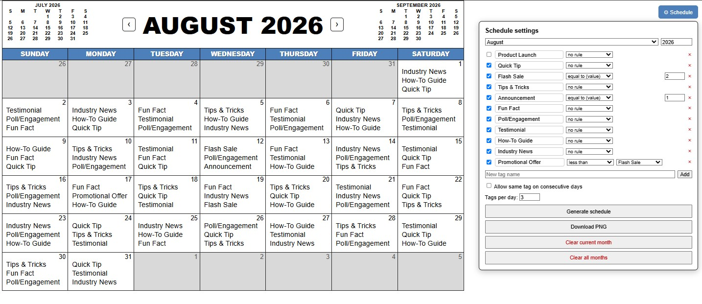

# Editable Calendar: Social Media Post Schedule

A single-file, offline-capable editable monthly calendar for planning social-media
post schedules. There is no build step, no dependencies, and no server. Everything
is inside `august-2026-editable-calendar.html`.

## Screenshots

## Usage

Open `august-2026-editable-calendar.html` in any browser (works straight from
`file://`, no internet needed).

## Features

- **Editable everything**
  click the title, weekday headers, or any day cell and
  type. Edits are saved automatically to `localStorage`, per month, so each month
  keeps its own posts and title.
  
- **Month navigation**
  `‹ ›` arrows next to the title, or the month/year pickers
  in the settings panel. Mini calendars for the previous/next month sit in the
  header.
  
- **Schedule generator**
  open the ⚙ Schedule panel, define your tags (post
  types) — add, remove, or rename them inline — and click *Generate schedule*
  to fill the month. Each day gets 3 distinct tags by default — change *Tags
  per day* (1–6) to fit your posting cadence (the day-cell text scales down
  automatically so every line fits). Per-tag rules:
  - *less than / more than / equal to* another tag (relative frequency)
  - *less than / more than / equal to (value)* — an exact target count for the month
  - optional per-tag permission to appear on back-to-back days
  
- **PNG export**
  *Download PNG* renders the calendar to a 3×-scale image
  (3543×2223) that matches what you see on screen, including hand-edited cells.
  
- **Print-friendly**
  the page is sized 1181×741 px to match `@page`; panel
  buttons and nav arrows are hidden when printing.

## Data storage

All data stays in your browser's `localStorage` under the
`august-2026-editable-calendar:` prefix (historical name, kept for compatibility).
Clearing browser data for the file/origin erases saved schedules. *Clear current
month* / *Clear all months* buttons are in the settings panel.
